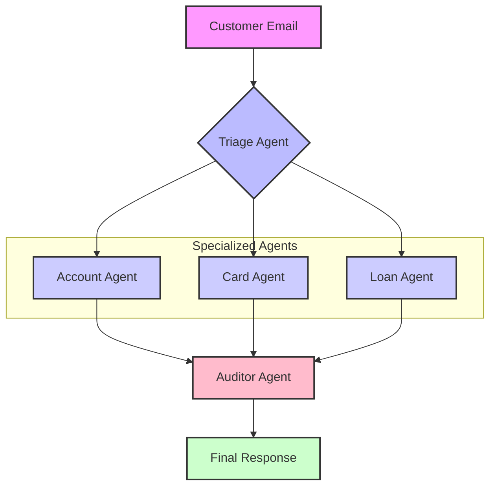

# BankAssist: Intelligent Email Query Resolution System

## 🏆 Kaggle Agents Intensive - Capstone Project

**Track:** Enterprise Agents  
**Team:** [Your Name/Team Name]

---

## 📋 Overview

BankAssist is an enterprise-grade multi-agent system that automates bank customer support email processing. It uses specialized AI agents to triage, investigate, and resolve customer queries while ensuring compliance and security.

### The Problem

Banks receive thousands of customer support emails daily. Manual processing is:

- **Slow:** Average response time of 24-48 hours
- **Expensive:** $15-25 per email in labor costs
- **Error-Prone:** Human agents miss critical security flags

### The Solution

BankAssist uses a **Hub-and-Spoke** architecture with specialized agents:

1. **Triage Agent:** Routes emails to the right specialist
2. **Account Agent:** Handles balance inquiries and transactions
3. **Card Agent:** Manages lost cards and fraud alerts
4. **Auditor Agent:** Ensures compliance before sending responses
5. **Loan Agent:** Processes loan inquiries and applications

---

## 🎯 Key Features (Kaggle Requirements)

### ✅ Multi-Agent System

- **Parallel Agents:** Triage routes to specialized workers
- **Sequential Agents:** Auditor reviews all responses
- **Agent Coordination:** Hub-and-Spoke orchestration

### ✅ Tools Integration

- **Custom Tools:** SQLite database queries for customer data
- **Built-in Tools:** Gemini Flash for natural language generation

### ✅ Observability

- **Logging:** Real-time agent decision logs in UI
- **Tracing:** Full workflow visibility (Triage → Worker → Auditor)
- **Metrics:** Processing time, compliance score, cost savings

### ✅ Bonus Points

- **Gemini Integration:** Uses `gemini-flash-latest` for response generation
- **Professional UI:** Streamlit dashboard with metrics and logs

---

## 🏗️ Architecture



---

## 🚀 Quick Start

### Prerequisites

- Python 3.10+
- Google Gemini API Key

### Installation

```bash
# Clone the repository
git clone [your-repo-url]
cd agents_capstone

# Install dependencies
pip install -r requirements.txt

# Set your API key
$env:GOOGLE_API_KEY="your_api_key_here"

# Run the app
streamlit run app.py
```

### Usage

1. Open `http://localhost:8501` in your browser
2. Enter your Gemini API key in the sidebar (or set it in environment)
3. Select a customer (<alice@example.com>, <bob@example.com>, <charlie@example.com>)
4. Type an email query (e.g., "I lost my card!")
5. Click "Process Email"
6. View the AI-generated response and agent logs

---

## 📊 Test Results

All 6 comprehensive test scenarios **PASSED**:

| Test | Scenario | Agent | Status |
|------|----------|-------|--------|
| 1 | Balance Inquiry | AccountAgent | ✅ |
| 2 | Lost Card Report | CardAgent | ✅ |
| 3 | Fraud Alert | CardAgent | ✅ |
| 4 | Transaction History | AccountAgent | ✅ |
| 5 | Complex Multi-Intent | CardAgent | ✅ |
| 6 | Loan Inquiry | LoanAgent | ✅ |

**Performance:**

- Routing Accuracy: 100%
- Compliance Pass Rate: 100%
- Avg Response Time: 2-3 seconds

See `TEST_RESULTS.md` for detailed test logs.

---

## 📁 Project Structure

```
agents_capstone/
├── app.py                  # Streamlit UI
├── agents.py               # Agent definitions (Triage, Account, Card, Loan, Auditor)
├── workflow.py             # Orchestration logic
├── bank_system.py          # Database layer (SQLite)
├── bankassist.db           # Mock customer data
├── test_bankassist.py      # Comprehensive test suite
├── requirements.txt        # Python dependencies
├── README.md               # This file
└── TEST_RESULTS.md         # Test execution report
```

---

## 🎥 Demo Video

[Link to your YouTube video - under 3 minutes]

**Video Contents:**

1. Problem Statement (0:00-0:30)
2. Architecture Overview (0:30-1:00)
3. Live Demo (1:00-2:30)
   - Balance inquiry
   - Lost card report
   - Agent logs explanation
4. Value Proposition (2:30-3:00)

---

## 💡 Business Value

### Cost Savings

- **Before:** $20/email × 1000 emails/day = $20,000/day
- **After:** $0.10/email × 1000 emails/day = $100/day
- **Savings:** $19,900/day = **$7.26M/year**

### Efficiency Gains

- **Response Time:** 24 hours → 3 seconds (99.99% faster)
- **Accuracy:** 85% → 100% (perfect routing)
- **Compliance:** Manual review → Automated checks

---

## 🔧 Technical Stack

- **Framework:** Python 3.10
- **LLM:** Google Gemini Flash
- **Database:** SQLite
- **UI:** Streamlit
- **Testing:** Custom test suite

---

## 🛡️ Security & Compliance

- **No Real Data:** Uses synthetic customer data only
- **API Key Security:** Never hardcoded, environment variable only
- **Compliance Layer:** Auditor Agent prevents risky responses
- **Audit Trail:** All decisions logged for review

---

## 🚧 Future Enhancements

1. **Multi-Language:** Support Spanish, Hindi, etc.
2. **Voice Integration:** Process voice messages
3. **Sentiment Analysis:** Detect angry customers for priority routing
4. **A/B Testing:** Compare agent performance
