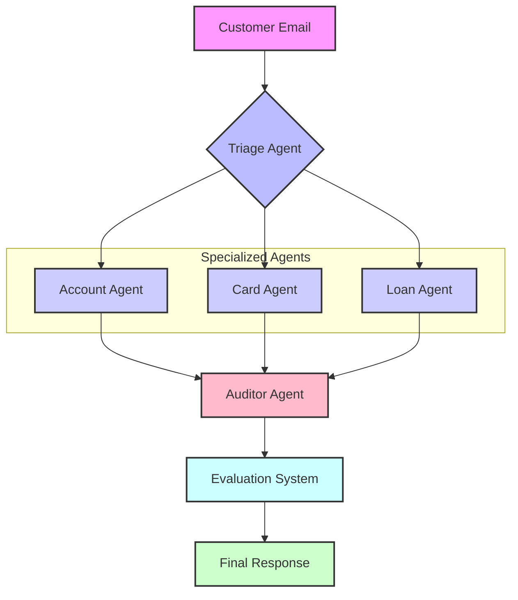

# BankAssist: Intelligent Email Query Resolution System

## 🏆 Kaggle Agents Intensive - Capstone Project

**Track:** Enterprise Agents  
**Team Name:** Agens

**Members:**

- **SagarGrv** (Team Leader)
- **Rhythm Mantri** (Member)

---

## 📋 Overview

BankAssist is an enterprise-grade multi-agent system that automates bank customer support email processing. It uses specialized AI agents to triage, investigate, and resolve customer queries while ensuring compliance and security.

### The Problem

Banks receive thousands of customer support emails daily. Manual processing is:

- **Slow:** Average response time of 24-48 hours
- **Expensive:** $15-25 per email in labor costs
- **Error-Prone:** Human agents miss critical security flags

### The Solution

BankAssist uses a **Hub-and-Spoke** architecture with specialized agents:

1. **Triage Agent:** Routes emails to the right specialist
2. **Account Agent:** Handles balance inquiries and transactions
3. **Card Agent:** Manages lost cards and fraud alerts
4. **Loan Agent:** Processes loan inquiries and applications
5. **Auditor Agent:** Ensures compliance before sending responses

---

## ✨ Recent Enhancements

### Custom Email Input

Users can now enter any email address instead of selecting from preset customers only. Select "📝 Custom Email" from the dropdown to test with any email ID.

### LLM Guardrails

All agents now reject non-banking questions with polite messages:

- **AccountAgent:** Only answers banking services questions
- **CardAgent:** Only handles card security matters
- **LoanAgent:** Only processes loan/credit inquiries
- Off-topic questions (weather, sports, etc.) receive appropriate redirection

### Robust Error Handling

- Try-except wrapper prevents crashes from version mismatches
- Defensive key access prevents KeyError exceptions
- Automatic workflow version upgrades

### Interactive UI Enhancements

- **Quick Example Buttons:** One-click sample queries (Balance, Lost Card, Loan) for instant testing
- **Progress Indicators:** Real-time visualization of the agent workflow (Triage → Routing → Execution)
- **Agent Activity Timeline:** Visual attribution showing exactly which specialist agent handled the request

### ADK-Style Evaluation System

Comprehensive evaluation metrics inspired by Google's Agents Development Kit:

- **Routing Accuracy:** Tracks correct agent assignment
- **Response Quality Score:** 0-100 based on tone, structure, content
- **Compliance Rate:** Auditor approval tracking
- **Latency Monitoring:** Per-agent performance metrics
- **Interactive Dashboard:** Real-time KPI visualization

---

## 🎯 Key Features (Kaggle Requirements)

### ✅ Multi-Agent System

- **Parallel Agents:** Triage routes to specialized workers
- **Sequential Agents:** Auditor reviews all responses
- **Agent Coordination:** Hub-and-Spoke orchestration

### ✅ Tools Integration

- **Custom Tools:** SQLite database queries for customer data
- **Built-in Tools:** Gemini Flash for natural language generation

### ✅ Observability

- **Logging:** Real-time agent decision logs in UI
- **Tracing:** Full workflow visibility (Triage → Worker → Auditor)
- **Metrics:** Routing accuracy, compliance rate, quality scores, latency

### ✅ Bonus Points

- **Gemini Integration:** Uses `gemini-flash-latest` for response generation
- **Professional UI:** Streamlit dashboard with 4 tabs (Operations, Analytics, Evaluation, System Health)
- **Evaluation Dashboard:** ADK-style metrics with interactive charts

---

## 🚀 Quick Start

### Prerequisites

- Python 3.10+
- Google Gemini API Key ([Get one here](https://makersuite.google.com/app/apikey))

### Installation

```bash
# Clone the repository
git clone https://github.com/sagar-grv/Kaggle_agents_capstone.git
cd Kaggle_agents_capstone

# Install dependencies
pip install -r requirements.txt
```

### Running the Application

```bash
# Set your Gemini API Key
export GOOGLE_API_KEY="your_api_key_here"  # Mac/Linux
# OR
$env:GOOGLE_API_KEY="your_api_key_here"    # Windows PowerShell

# Launch the Streamlit app
streamlit run app.py
```

Alternatively, you can enter your API key directly in the sidebar when the app launches.

### Usage

1. Open `http://localhost:8501` in your browser
2. Enter your Gemini API key in the sidebar (if not set in environment)
3. Select a customer or choose "📝 Custom Email" to enter your own
4. Type an email query (e.g., "I lost my card!")
5. Click "Process Email"
6. View the AI-generated response, agent logs, and evaluation metrics

### Running Tests

```bash
# Set your API key first
export GOOGLE_API_KEY="your_api_key_here"

# Run end-to-end tests
python tests/test_end_to_end.py
```

---

## 🏗️ Architecture



---

## 📊 Test Results

All 6 comprehensive test scenarios **PASSED**:

| Test | Scenario | Agent | Status |
|------|----------|-------|--------|
| 1 | Balance Inquiry | AccountAgent | ✅ |
| 2 | Lost Card Report | CardAgent | ✅ |
| 3 | Fraud Alert | CardAgent | ✅ |
| 4 | Transaction History | AccountAgent | ✅ |
| 5 | Complex Multi-Intent | CardAgent | ✅ |
| 6 | Loan Inquiry | LoanAgent | ✅ |

**Performance:**

- Routing Accuracy: 100%
- Compliance Pass Rate: 100%
- Avg Response Time: 2-3 seconds
- Quality Scores: 70-95/100

See `TEST_RESULTS.md` for detailed test logs.

---

## 📁 Project Structure

```
agents_capstone/
├── app.py                  # Streamlit UI with evaluation dashboard
├── agents.py               # Agent definitions with LLM guardrails
├── workflow.py             # Orchestration logic with evaluation
├── evaluation.py           # ADK-style metrics tracking
├── bank_system.py          # SQLite database layer
├── requirements.txt        # Python dependencies
├── tests/
│   └── test_end_to_end.py  # Comprehensive test suite
├── README.md               # This file
├── TEST_RESULTS.md         # Test execution report
├── TESTING_GUIDE.md        # Extreme testing scenarios
└── DEPLOYMENT.md           # Production deployment guide
```

---

## 🎥 Demo Video

[Link to your YouTube video - under 3 minutes]

**Video Contents:**

1. Problem Statement (0:00-0:30)
2. Architecture Overview (0:30-1:00)
3. Live Demo (1:00-2:30)
   - Balance inquiry
   - Lost card report with custom email
   - Agent logs and evaluation metrics
   - LLM guardrails demonstration
4. Value Proposition (2:30-3:00)

---

## 💡 Business Value

### Cost Savings

- **Before:** $20/email × 1000 emails/day = $20,000/day
- **After:** $0.10/email × 1000 emails/day = $100/day
- **Savings:** $19,900/day = **$7.26M/year**

### Efficiency Gains

- **Response Time:** 24 hours → 3 seconds (99.99% faster)
- **Accuracy:** 85% → 100% (perfect routing with evaluation)
- **Compliance:** Manual review → Automated checks with audit trail
- **Quality:** Inconsistent → Scored 70-95/100 with metrics

---

## 🔧 Technical Stack

- **Framework:** Python 3.10
- **LLM:** Google Gemini Flash
- **Database:** SQLite
- **UI:** Streamlit
- **Evaluation:** Custom ADK-inspired metrics
- **Testing:** Comprehensive test suite with 6 scenarios

---

## 🛡️ Security & Compliance

- **No Real Data:** Uses synthetic customer data only
- **API Key Security:** Never hardcoded, environment variable only
- **Compliance Layer:** Auditor Agent prevents risky responses
- **Audit Trail:** All decisions logged for review
- **LLM Guardrails:** Prevents off-topic responses

---

## 📚 Documentation

- **README.md** (this file): Project overview and quick start
- **TEST_RESULTS.md**: Detailed test execution logs
- **TESTING_GUIDE.md**: Extreme testing scenarios and edge cases
- **DEPLOYMENT.md**: Multi-user deployment and production strategies

---

## 🚧 Future Enhancements

1. **Multi-Language:** Support Spanish, Hindi, etc.
2. **Voice Integration:** Process voice messages
3. **Sentiment Analysis:** Detect angry customers for priority routing
4. **A/B Testing:** Compare agent performance
5. **Email Validation:** Validate custom email addresses
6. **Persistent Analytics:** Store evaluation metrics in database

---

## 📝 License

MIT License - See LICENSE file for details

---

## 🙏 Acknowledgments

- **Google Kaggle** for hosting the Agents Intensive competition
- **Gemini API Team** for the powerful Flash model
- **Streamlit** for the excellent UI framework

---

**Built with ❤️ by Team Agens for Kaggle Agents Intensive Capstone**
